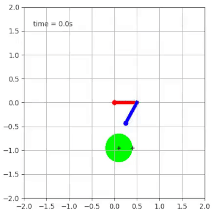

# Contact trajectory Optimization
Implementations for Trajectory Optimization of Rigid Bodies Through Contact

## Finger Contact
In this example we have a system with three degrees of freedom and only one contact point, We constrained the system to start and end at rest, `dq1 = 0, dq2 = 0, dq3 = 0`,
and optimize for a quadratic cost on control input and velocity of the free circle

